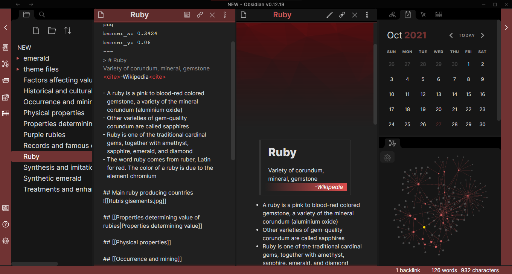

---

## Ruby
A red/ruby theme for [Obsidian.md](https://obsidian.md/)

It is a modified version of cotemaxine's amethyst theme

It works best with dark theme

You can install from the Custom CSS plugin in the app itself or manually

It supports using `<cite>`[snippet from Palatinate theme]
  
## Manual installation
- Download obsidian.css
- Put the obsidian.css file in the root of the vault
- Enable the custom css plugin
- Refresh the app
